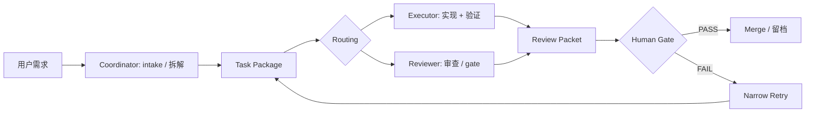

<div align="center">

# Cursor AgentPilot

**光标驾驶舱**

从 Cursor 新手入门，到把任务稳定派发给 Codex / Claude 的实战工作流手册，<br>并沉淀为一套可被工具消费的派发协议。

[](LICENSE)
[](docs/)
[](CONTRIBUTING.md)
[](templates/task-package.md)

*别让 Agent 替你猜任务。先把任务变成协议，再把协议派给合适的 Agent。*

</div>

---

## 📌 这是什么

Cursor 已经从代码编辑器演进为 agentic coding 工作台，但新手的真实痛点不是"不会点按钮"，而是：

- 不知道什么时候用 Chat、Agent、Plan、Multitask、Worktree。
- 不知道怎么描述任务，导致 Agent 改错范围或漏验收标准。
- 不知道 Cursor、Codex、Claude 各自适合承担什么角色。
- 多工具协作时，任务上下文、验收标准、review 结论容易丢。
- 多 Agent 并行会放大冲突、成本、重复修改和不可控变更。

本项目是 **工作流手册 + 派发协议**，不是官方文档翻译，也不是泛 AI 工具测评。它覆盖完整闭环：intake → task package → routing → 执行 → review → gate → 留档。

## 🧭 角色模型

协议按 **角色** 设计，不绑定具体工具：

| 角色 | 职责 | 默认承担者 |
| --- | --- | --- |
| **Coordinator**（cockpit） | 输入、理解、拆解、协调、轻量执行 | Cursor |
| **Executor** | 本地 repo 修改、跑测试、验证、交付总结 | Codex |
| **Reviewer / Architect** | 方案评审、代码 review、风险发现、gate 判断 | Claude（没有 Claude 也能用，见立项书 9.4 双工具降级模式） |

**Markdown task package 是跨工具交接协议**：谁接任务都先读同一份上下文。



## ⚡ 5 分钟快速开始

1. **读定位**：花 1 分钟读完"这是什么"，确认你的场景匹配。
2. **挑一个真实小任务**：比如"修一个已知 bug"或"加一个小函数"，不要从大重构开始。
3. **复制模板**：把 `templates/task-package.md` 复制一份，按字段说明填写背景、目标、范围（allow/deny）、隔离级别、验收标准。
4. **选路径派发**：对照 `docs/03-dispatch-design.md` 的 routing matrix（骨架期可先看 `docs/00-project-brief.md` 第 9.2 节），判断这个任务该交给 Cursor 直接改、Codex 执行，还是需要 reviewer 审查（默认 Claude，双工具模式见立项书 9.4）。
5. **验收与留档**：执行完成后对照验收标准逐条检查；如果走了 executor / reviewer 派发，用 `templates/review-packet.md` 汇总证据，由你做最终 human gate。

跑完一次闭环，你就理解了本项目的全部核心概念：task package → routing → 执行 → review → gate。

## 🗺️ 新手路径

按顺序阅读，每一步都有明确产出：

| 步骤 | 阅读 | 你将学会 |
| --- | --- | --- |
| 1 | [`docs/01-cursor-beginner-guide.md`](docs/01-cursor-beginner-guide.md) | Cursor 基础界面与核心能力，完成第一次 AI 辅助修改 |
| 2 | [`docs/02-agent-mode-map.md`](docs/02-agent-mode-map.md) | Chat / Agent / Plan / Multitask / Worktree 各自的使用边界 |
| 3 | [`docs/03-dispatch-design.md`](docs/03-dispatch-design.md) | 把任务拆成 task package，派发给 executor / reviewer |
| 4 | [`docs/04-quality-gate.md`](docs/04-quality-gate.md) | 用验收标准、review、human gate 控制质量 |
| 5 | [`docs/05-cost-and-risk.md`](docs/05-cost-and-risk.md) | 控制多 Agent 协作的成本与风险 |
| 6 | [`examples/`](examples/) 任意案例 | 端到端复制一次完整派发闭环 |

## 📂 目录导航

```text
cursor-agentpilot/
  README.md                        # 本文件：定位、快速开始、导航
  LICENSE                          # CC BY 4.0
  CONTRIBUTING.md                  # 贡献指引
  docs/
    00-project-brief.md            # 立项书：架构、护城河、协议规范（已定稿）
    01-cursor-beginner-guide.md    # Cursor 新手手册（正文完成）
    02-agent-mode-map.md           # Chat/Agent/Plan/Multitask/Worktree 使用边界（正文完成）
    03-dispatch-design.md          # coordinator -> executor/reviewer 任务派发设计
    04-quality-gate.md             # 验收、review、human gate
    05-cost-and-risk.md            # 成本与风险控制
    changelog-watch.md             # Cursor 更新对手册的影响追踪
  templates/
    task-package.md                # 任务包模板（任务的唯一事实来源）
    review-packet.md               # 审查包模板（执行证据与审查结论）
    acceptance-checklist.md        # 验收清单模板
    cursor-prompt-snippets.md      # Cursor 常用 prompt 片段
  examples/
    feature-flow.md                # 功能开发端到端案例
    bug-hunt-flow.md               # bug 排查修复案例
    ui-polish-flow.md              # UI 打磨案例
    refactor-flow.md               # 重构案例
    docs-flow.md                   # 文档任务案例
  runs/                            # 真实派发留档（P2 起启用）
  plans/
    plan.md                        # 开发计划与任务拆解
```

## 📦 协议与隔离机制一览

每个跨工具任务先产出 task package（YAML frontmatter + Markdown 正文，人读正文、工具读字段）：

| 字段 | 作用 |
| --- | --- |
| `task_id` / `type` / `route` | 任务标识、类型与派发路径 |
| `scope.allow` / `scope.deny` | 允许与禁止修改的文件范围 |
| `acceptance[]` | 可执行、可判定的验收标准 |
| `risk_level` / `gate_required` | 风险等级与门禁要求 |
| `isolation` | 执行隔离级别：`none` / `branch` / `worktree` |

隔离机制是硬约束而非建议：**并行写同一 repo 的任务强制各自独立 worktree，merge 动作只能由 human gate 执行**——用机制而不是纪律避免多 Agent 同仓冲突（详见立项书 9.5）。

协议三件套：Task Package（任务唯一事实来源）→ Review Packet（执行证据与审查结论）→ Run Record（闭环留档）。

## 📄 开源协议

- 本仓库内容（手册、案例、README 等）采用 [CC BY 4.0](LICENSE) 许可：可自由转载、修改、商用，需署名。
- `templates/` 目录下的四个模板额外声明 **CC0（公有领域）**：模板生来就是要被复制进你的私有项目的，不应带任何署名负担，直接拿走即可。

## 🤝 参与贡献

欢迎报告过期内容、提交真实派发案例、完善协议字段，入口见 [CONTRIBUTING.md](CONTRIBUTING.md)。协议 schema 字段的增删改需先开 issue 讨论。

## ⏱️ 时效性说明

Cursor 迭代很快，本手册用机制对抗过期：

- 每章 frontmatter 标注 `last_verified` 核验日期与 `sources` 来源链接。
- [`docs/changelog-watch.md`](docs/changelog-watch.md) 追踪 Cursor changelog 对各章的影响面。
- 每个 Cursor 大版本发布后 7 天内核验受影响章节。

具体功能表述如与 Cursor 官方行为不一致，以 [官方文档](https://docs.cursor.com) 为准，并欢迎提 issue 告诉我们。
