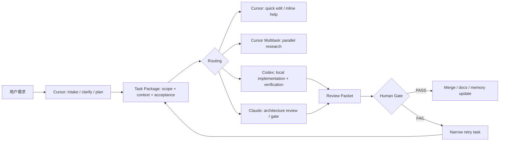
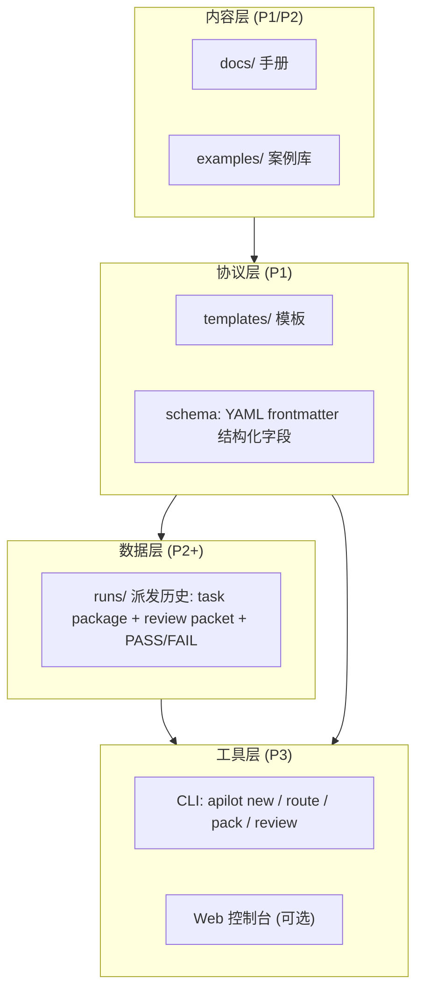

# Cursor AgentPilot 项目立项书

版本：v0.2（在 v0.1 基础上补全：护城河、系统架构、协议规范、演进路线）
日期：2026-07-08
项目类型：新手手册 + 多 Agent 任务派发工作流设计 + 可复用模板库 + 可演进的协议/工具层

## 1. 项目命名

主名称：**Cursor AgentPilot**
中文名：**光标驾驶舱**

一句话定位：从 Cursor 新手入门，到把任务稳定派发给 Codex / Claude 的实战工作流手册，并沉淀为一套可被工具消费的派发协议。

## 2. 项目背景

Cursor 已从代码编辑器演进为 agentic coding 工作台：Agent Window 支持 `/multitask` 并行 async subagents，Worktrees / multi-root workspaces 让后台分支和跨仓库任务更易承载。

新手的真实痛点不是"不会点按钮"，而是：

- 不知道什么时候用 Chat、Agent、Plan、Multitask、Worktree。
- 不知道怎么描述任务，导致 Agent 改错范围或漏验收标准。
- 不知道 Cursor、Codex、Claude 各自适合承担什么角色。
- 多工具协作时，任务上下文、验收标准、review 结论容易丢。
- 多 Agent 并行会放大冲突、成本、重复修改和不可控变更。

本项目用一套可执行的手册、派发协议和模板，把"会用 Cursor"升级为"能管理多 Agent 交付"。

参考源：

- Cursor changelog: Multitask, Worktrees, and Multi-root Workspaces, 2026-04-24: https://cursor.com/changelog/04-24-26
- Cursor forum: `/multitask in Agents Window`: https://forum.cursor.com/t/multitask-in-agents-window/158955

## 3. 项目目标

### 3.1 直接目标（MVP）

面向中文用户的 Cursor 新手到进阶手册，覆盖：

- Cursor 基础界面和核心能力。
- 常见开发任务怎么写 prompt。
- `Agent`、`Plan`、`Multitask`、`Worktree` 的使用边界。
- 如何把任务拆成可执行 task package。
- 如何把任务派给 Codex 执行、Claude review 或规划。
- 如何用验收标准、测试命令、diff review、human gate 控制质量。

### 3.2 长期目标

形成一个轻量 AgentOps 工作流，并让协议本身可被工具消费：



## 4. 目标用户

- 刚开始用 Cursor 的开发者。
- 想从"让 AI 写代码"升级到"用 AI 管理开发流程"的独立开发者。
- 使用 Cursor + Codex + Claude 的多模型用户。
- 小团队技术负责人，需要定义 agentic coding 规范。
- 需要把需求、开发、review、验收串起来的产品型开发者。

## 5. 核心定位

本项目不是 Cursor 官方文档翻译，也不是泛 AI 工具测评。它是 **工作流手册 + 派发协议**：

- Cursor 是 cockpit：输入、理解、拆解、协调、轻量执行。
- Codex 是 executor：本地 repo 修改、测试、浏览器验证、交付总结。
- Claude 是 reviewer / architect：方案评审、代码 review、风险发现、gate 判断。
- Markdown task package 是跨工具交接协议：谁接任务都先读同一份上下文。

## 6. 系统架构（v0.2 新增）

项目分四层，MVP 只做前两层，但从第一天起就按四层设计，保证内容资产可以无损升级为工具资产。



### 6.1 内容层

面向人的手册与案例。docs 讲原理与边界，examples 给端到端可复制流程。

### 6.2 协议层（核心资产）

所有模板都是 "Markdown 正文 + YAML frontmatter" 双态结构：

- 人读正文，工具读 frontmatter。
- frontmatter 定义结构化字段：`task_id`、`type`、`route`、`scope.allow`、`scope.deny`、`acceptance[]`、`risk_level`、`gate_required`。
- 这使 P1 的手册模板到 P3 的 CLI 之间没有迁移成本：CLI 直接 parse 现有模板。

协议三件套：

| 协议 | 作用 | 消费者 |
| --- | --- | --- |
| Task Package | 任务的唯一事实来源 | Cursor / Codex / Claude / 人 |
| Review Packet | 执行证据与审查结论 | Claude / 人（gate） |
| Run Record | 一次派发的完整闭环记录 | 数据层，复盘与度量 |

### 6.3 数据层

每次真实派发在 `runs/YYYY-MM-DD-<slug>/` 留档：task package、review packet、gate 结论、耗时与重试次数。它既是案例库的原料，也是后续度量（成功率、返工率、成本）的数据基础。

### 6.4 工具层（P3，非 MVP）

轻量 CLI `apilot`，只做四件事：生成 task package（`new`）、推荐路由（`route`）、汇总输出为 review packet（`pack`）、记录 gate 结论（`review`）。不做 agent runtime，不和任何厂商 API 绑定——工具只操作本地 Markdown/YAML，保持零依赖可退化（没有 CLI 时手动复制模板同样可用）。

## 7. 护城河（v0.2 新增）

内容型项目容易被复制，护城河设计围绕"复制内容容易，复制体系难"：

### 7.1 协议标准化

Task package / review packet 不是文章配图，而是带 schema 的可执行协议。谁先定义出被高频使用的字段结构，谁就成为默认标准。模板保持向后兼容和版本号（`protocol_version`），第三方工具可以直接消费。

### 7.2 闭环案例数据

examples 与 runs 全部来自真实派发闭环，含 FAIL 与 retry 记录，不是摆拍成功案例。真实失败数据是最难复制的内容——竞品可以抄目录，抄不了积累。

### 7.3 时效性维护机制

Cursor 迭代快是行业性痛点，把它变成优势：

- 每章标注 `last_verified` 日期与来源链接。
- 维护一份 `docs/changelog-watch.md`：追踪 Cursor changelog 对手册的影响面，标注"哪个功能更新影响哪一章"。
- 承诺核验节奏（每个 Cursor 大版本发布后 7 天内核验受影响章节）。持续更新本身构成对静态教程的碾压。

### 7.4 中文语境 + 端到端闭环

英文社区有零散 best practices，中文没有系统化的"多 Agent 派发"工作流手册。且本项目覆盖的是完整闭环（intake → routing → 执行 → review → gate → 留档），不是单点技巧集合。

### 7.5 内容到工具的升级路径

先手册聚人，再协议聚工具，最后 CLI/控制台聚工作流。用户按模板积累的 runs 数据天然存在本项目的目录结构里，迁移成本随使用时间增长——这是最终的锁定效应。

### 7.6 明确不做什么（负向护城河）

- 不做 agent runtime / 厂商 API 封装（避免被官方更新一夜清零）。
- 不做泛 AI 工具测评（避免和自媒体内卷）。
- 不绑定私有服务（模板零依赖，信任成本低）。

## 8. 产品范围

### 8.1 P1: 手册与协议

- `README.md`：项目定位、快速开始、目录导航。
- `docs/01-cursor-beginner-guide.md`：Cursor 新手手册。
- `docs/02-agent-mode-map.md`：Chat / Agent / Plan / Multitask / Worktree 使用边界。
- `docs/03-dispatch-design.md`：Cursor -> Codex / Claude 任务派发设计。
- `docs/04-quality-gate.md`：验收、review、human gate。
- `docs/05-cost-and-risk.md`：成本与风险控制。
- `templates/task-package.md`、`templates/review-packet.md`、`templates/acceptance-checklist.md`、`templates/cursor-prompt-snippets.md`。

验收标准：

- 新手能按手册完成一次小功能修改。
- 用户能根据 routing matrix 判断任务路径。
- 每个模板可直接复制使用，且 frontmatter 字段完整、可被 YAML parser 解析。

### 8.2 P2: 案例库

`examples/`：feature-flow、bug-hunt-flow、ui-polish-flow、refactor-flow、docs-flow。

验收标准：

- 每个案例包含输入 prompt、任务包、派发路径、验收命令、review 结果样例。
- 每个案例标明适合单 Agent、Multitask，还是 Codex + Claude gate。
- 至少 1 个案例包含真实 FAIL → narrow retry → PASS 记录。

### 8.3 P3: 可选工具化

`apilot` CLI（见 6.4）。P3 不是 MVP 必需。

## 9. 任务派发设计

### 9.1 角色分工

| 角色 | 最适合做 | 不适合做 |
| --- | --- | --- |
| Cursor | 新手学习、轻量编辑、快速解释、需求拆解、任务协调、并行 research | 长时间本地验证、复杂 repo-wide 修改、严格 gate |
| Cursor Multitask | 多个互不依赖的调研/小任务并行 | 多个 subagents 同时改同一文件或核心链路 |
| Codex | 本地 repo 执行、文件修改、跑测试、浏览器 QA、交付总结 | 没有明确验收标准的大方向探索 |
| Claude | 架构判断、方案评审、代码 review、风险发现、P1/P2 gate | 直接长期持有本地执行状态 |

### 9.2 Routing Matrix

| 任务类型 | 推荐路径 | 原因 | 成本 |
| --- | --- | --- | --- |
| "解释 Cursor 怎么用" | Cursor | 交互式问答最快 | 低 |
| "帮我写一个小函数" | Cursor 或 Codex | 小改动 Cursor 足够；涉及 repo 验证交给 Codex | 低 |
| "修一个 bug" | Codex -> Claude review | 需要 trace、修复、测试、gate | 中 |
| "大功能拆解" | Cursor Plan -> task package -> Codex | 先规划，再执行 | 中 |
| "多个独立调研" | Cursor Multitask | 并行收益高，冲突低 | 中 |
| "跨前后端联调" | Codex implementation + Claude gate | 合同多、风险高 | 高 |
| "架构方案比较" | Claude -> Cursor/Codex 落地 | Claude 适合风险和方案辨析 | 中 |
| "上线前检查" | Codex verify -> Claude review | 执行证据 + 独立审查 | 高 |

### 9.3 派发协议

每个跨工具任务必须先产出 task package，至少包含：背景、目标、范围（allow/deny）、非目标、上下文、验收（命令/路径/截图/gate）、风险、交付。

## 10. 仓库架构

```text
cursor-agentpilot/
  README.md
  docs/
    00-project-brief.md          # 本文件
    01-cursor-beginner-guide.md
    02-agent-mode-map.md
    03-dispatch-design.md
    04-quality-gate.md
    05-cost-and-risk.md
    changelog-watch.md           # Cursor 更新对手册的影响追踪
  templates/
    task-package.md
    review-packet.md
    acceptance-checklist.md
    cursor-prompt-snippets.md
  examples/
    feature-flow.md
    bug-hunt-flow.md
    ui-polish-flow.md
    refactor-flow.md
    docs-flow.md
  runs/                          # 真实派发留档（P2 起启用）
    .gitkeep
  plans/
    plan.md                      # 开发计划与任务拆解
```

## 11. 质量原则

- 先小任务，后大任务。
- 先 task package，后派发。
- 先 trace，后修改。
- 先本地验证，后声称完成。
- 先 review packet，后 Claude gate。
- 并行只用于低耦合任务。
- 涉及 auth、payment、data、deployment、shared contract 的任务必须走 gate。
- 每章标注 `last_verified` 与来源链接。

## 12. 风险与边界

| 风险 | 控制方式 |
| --- | --- |
| Cursor 功能更新快，手册过期 | `last_verified` + changelog-watch 机制（见 7.3） |
| 多 Agent 改同一文件冲突 | 默认不并行修改同一核心链路；worktree 或串行合并 |
| 成本不可控 | routing matrix 标注低/中/高成本 |
| 上下文泄漏 | task package 不写 secrets；review packet 不贴敏感 token |
| Claude / Codex 输出不一致 | human gate 以验收标准和本地验证为准 |
| 新手误把 Agent 当自动驾驶 | 每章保留 human gate 和 rollback 思维 |
| 内容被抄袭 | 护城河设计（第 7 节）：拼体系与数据积累，不拼单篇内容 |

## 13. 成功指标

第一版：

- 新手 30 分钟内理解 Cursor 基本工作流。
- 用户能用 task package 描述一个真实开发任务。
- 用户能判断任务适合哪条路径。
- 用户能完成一次 Codex implementation + Claude review gate 闭环。
- 所有模板可复制、可执行、frontmatter 可被解析、无私有依赖。

长期（P2/P3）：

- runs/ 积累 ≥ 20 个真实闭环记录。
- examples 至少 1 个含真实 FAIL → retry → PASS。
- 协议 schema 稳定到 v1.0（字段冻结，仅增不改）。

## 14. 开发计划

- Sprint 0（已完成）：立项，本文件。
- Sprint 1：文档骨架——目录结构、README、每个文档一级结构、模板 frontmatter schema 定稿。
- Sprint 2：新手手册——完成 docs/01、02，覆盖新手真实使用路径和错误案例。
- Sprint 3：派发设计——完成 docs/03、04、05，routing matrix、task package、review packet 全量内容。
- Sprint 4：示例闭环——bug hunt 和 feature delivery 两个端到端示例 + 第一批 runs 留档。

任务拆解与派发见 `plans/plan.md`。

## 15. 第一版口号

**别让 Agent 替你猜任务。先把任务变成协议，再把协议派给合适的 Agent。**
