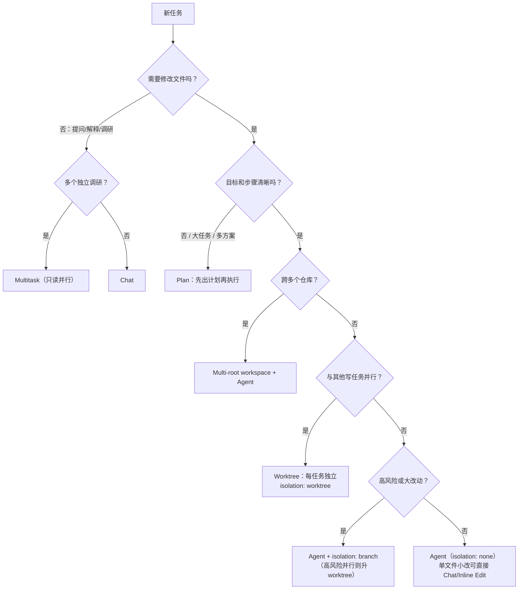

# Agent 模式地图：Chat / Agent / Plan / Multitask / Worktree / Multi-root

> 目标：面对任何任务，30 秒内判断该用哪种模式。模式选错的代价是范围失控、上下文丢失、并行冲突——这些比"AI 写错代码"更难收拾。

## 1. 为什么需要模式地图

Cursor 的各种模式不是功能列表，而是**不同的控制权分配方式**：从"你主导、AI 辅助"（Chat）到"AI 主导、你验收"（Agent/Multitask）。选模式的本质是回答两个问题：

1. 这个任务需要 AI 有多大的自主权？
2. 这个任务和其他任务会不会抢同一份文件？

第一个问题决定用 Chat / Agent / Plan，第二个问题决定要不要 Worktree 隔离。

## 2. Chat：交互式问答

**适合**：

- 解释代码、概念、报错信息。
- 边问边学的探索式场景（"这个项目的路由是怎么组织的？"）。
- 单文件内的小改动，你想看着它一步步来。

**不适合**：

- 跨多文件的修改（上下文和改动追踪都吃力）。
- 需要运行命令验证的任务。

**典型 prompt**：

```text
@src/router/index.ts 解释这个路由守卫的执行顺序，
以及未登录用户访问 /admin 时会发生什么。
```

**成本提示**：低。交互式问答按轮次消耗，不满意就换个问法，试错成本几乎为零。

## 3. Agent：单任务自主执行

Agent 模式下 AI 可以自主创建/修改多个文件、运行终端命令、根据报错迭代，直到完成任务或需要你介入。

**适合**：

- 目标明确、验收清晰的多文件任务（加一个功能、修一个已定位的 bug、写一组测试）。
- 需要"改代码 → 跑命令 → 看结果 → 再改"循环的任务。

**不适合**：

- 你自己都说不清目标的任务（先用 Chat 或 Plan 澄清）。
- 涉及不可逆操作（数据迁移、发布）而没有 human gate 的任务。

**典型 prompt**：

```text
给 @src/utils/date.ts 增加相对时间模式（今天/昨天/N 天前）。
约束：不改现有函数签名，不加依赖。
验收：pnpm test -- date 通过；为新模式补 3 个用例并贴出测试输出。
```

**成本提示**：中。Agent 会多轮自主迭代，任务描述越模糊烧得越多——四要素（目标/上下文/约束/验收）齐全是最好的省钱手段。

## 4. Plan：先规划后执行

Plan 模式让 AI 先产出执行计划（步骤、涉及文件、顺序），你审阅确认后再执行。

**适合**：

- 大任务：涉及多模块、步骤间有依赖。
- 多方案场景：需要先比较"怎么做"再动手。
- 需求还在成形：用计划本身帮你想清楚。

**不适合**：

- 显而易见的小改动（计划的开销超过任务本身）。

**典型 prompt**：

```text
用 Plan 模式拆解：把项目的日期处理从 moment 迁移到 dayjs。
输出：分几步、每步涉及哪些文件、如何保证每步之后测试仍然通过。
先不要改任何代码。
```

**成本提示**：中。规划本身多花一轮，但对大任务而言，一份被你修正过的计划能省下数倍的返工成本。计划审阅是第一道 human gate。

## 5. Multitask：并行子任务

Agent Window 支持 `/multitask`，把任务拆给多个 async subagents 并行执行（具体交互以 [官方文档](https://docs.cursor.com) 与 [changelog](https://cursor.com/changelog/04-24-26) 为准）。

**适合**：

- 多个互不依赖的**只读调研**："分别调研这三个库的 API 差异"。
- 多个互不依赖的小任务，且各自的文件范围不重叠。

**不适合**：

- 多个 subagents 需要写**同一个文件或同一条核心链路**——必然冲突。
- 步骤间有依赖的任务（B 需要 A 的产出）。

**典型 prompt**：

```text
/multitask
1. 调研 src/api 目录的错误处理现状，输出问题清单
2. 调研 src/components 里所有直接调用 fetch 的组件，列出文件清单
3. 整理项目当前的测试覆盖情况
（三个任务都只读，不修改任何文件）
```

**成本提示**：中偏高。N 个 subagents 就是 N 份消耗；并行的收益来自时间，不来自 token。只读调研是最安全的并行场景；**一旦 subagent 需要写文件，就必须按下一节的隔离级别升级**。

## 6. Worktree：物理隔离的并行执行

Worktrees 让每个后台任务在**独立目录 + 独立分支**中执行（`git worktree`），从机制上杜绝多 Agent 同仓冲突；multi-root workspaces 则允许一个窗口同时挂载多个仓库，承载跨仓库任务。

这不只是 Cursor 功能，更是本项目派发协议的核心：每个 task package 必须声明 `isolation` 隔离级别（与立项书 9.5 一致）：

| `isolation` | 含义 | 适用 |
| --- | --- | --- |
| `none` | 直接在当前工作区执行 | 只读调研、单任务串行、低风险小改动 |
| `branch` | 同工作区新分支执行 | 单任务但改动较大，需要干净的 diff 与可丢弃性 |
| `worktree` | 独立 git worktree（独立目录 + 独立分支）执行 | 并行执行任务、长耗时后台任务、高风险重构、实验性方案对比 |

强制升级规则（协议硬约束，不是建议）：

- 两个及以上写任务**时间上并行**且目标同一 repo → 每个任务 `isolation: worktree`。
- `risk_level: high` 或涉及 auth/payment/data/deployment/shared contract → 至少 `branch`，并行时必须 `worktree`。
- 方案对比（同一任务派发多个实现取优）→ 每个实现一个 worktree，best-of-N 后淘汰其余。
- Multitask 的只读 research subagents 不需要 worktree；一旦要写文件，按上表升级。

Worktree 生命周期五步：**创建**（`git worktree add ../<repo>-<task_id> -b task/<task_id>`）→ **执行**（executor 只在自己的 worktree 内工作）→ **交付**（review packet 附分支名与 `git diff main...task/<task_id>` 摘要）→ **合并即 gate**（merge 只能由 human gate 执行；FAIL 则在原 worktree 收窄重试或整个丢弃）→ **留档**（runs 记录分支名、合并 commit、丢弃原因）。

**成本提示**：高（每个 worktree 是完整工作目录，依赖安装、构建缓存都是独立的）。它买到的是**冲突为零和可丢弃性**——丢弃 worktree 就是回滚，这对高风险重构和方案对比是值得的。

## 7. Multi-root：跨仓库工作区

**适合**：任务天然横跨多个仓库（前端 + 后端联调、主仓 + 共享组件库），需要 AI 同时看到两边代码。

**不适合**：单仓库任务（多挂载的仓库只会稀释上下文）。

**典型 prompt**：

```text
（工作区同时挂载 frontend/ 与 backend/）
backend 的 /api/orders 响应新增了 refund_status 字段（见 @backend/src/routes/orders.ts），
在 @frontend/src/api/orders.ts 同步类型定义，并更新订单详情页展示。
```

**成本提示**：中。上下文变大，任务描述里更要精确 `@` 到具体文件。

## 8. 模式选择决策树



判断不了的时候用保守策略：**先 Plan，后 Agent；能串行不并行；要并行就 worktree**。

## 9. 下一步

模式解决"在 Cursor 里怎么执行"；当任务需要派给 Codex 执行或 reviewer 审查时，进入 [`03-dispatch-design.md`](03-dispatch-design.md)：把任务写成 task package，按 routing matrix 派发。
