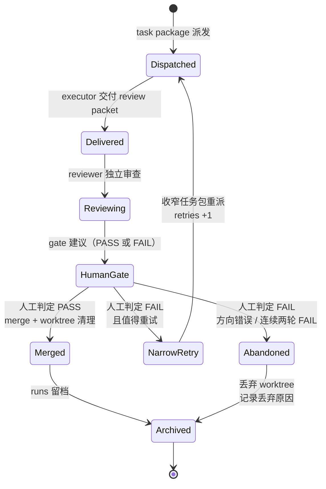

# 质量门禁：验收、review、human gate

> 目标：读完本章你能为任务写出可判定的验收标准，组织一份证据充分的 review packet，并按状态机执行 gate 判定。核心原则：**agent 说"已完成"不算完成，验收命令通过才算完成**。

## 1. 为什么需要 gate

Agent 输出不可直接信任，原因是结构性的，不是模型不够好：

- **执行方有"完成偏好"**：agent 倾向于报告成功，遇到边界情况可能绕过而不是暴露。
- **执行方无法自证**：跑过测试和"声称跑过测试"在对话里长得一模一样，需要证据而不是陈述。
- **自己改自己审无效**：执行上下文里的盲点会原样带进审查。

gate 在闭环中的位置：executor 交付 review packet → reviewer 独立审查 → human gate 终审并执行 merge。前两道可以按配置裁剪（见第 4 节），最后一道对高风险任务不可省略。

## 2. 验收标准写作法

一条合格的验收标准必须**可执行**（有具体命令或操作路径）且**可判定**（结果非黑即白）。写作时对每条问一句："两个人分别检查，结论会不会不一样？"会不一样就还不合格。

反例对照：

| ❌ 不可判定 | ✅ 可执行、可判定 |
| --- | --- |
| 代码质量好 | `npm test` 退出码 0，无新增 lint error |
| 页面体验流畅 | 首页 Lighthouse Performance ≥ 90（附报告截图） |
| 修好了重复提交的 bug | 快速点击提交按钮 5 次，Network 面板只出现 1 个 POST 请求（附截图） |
| 兼容移动端 | 375px 宽度下无横向滚动条，卡片单列展示（附截图） |
| 不影响现有功能 | 全量 `pnpm test` 通过；`git diff --stat` 不含 scope.allow 之外的文件 |

三类常用证据形式：**命令 + 预期退出码/输出**、**路径 + 预期状态**（文件存在、页面可访问）、**截图对照**（UI 类任务）。每条验收都应能归入其中一类。

## 3. Review Packet 组织法

review packet 是执行方的"证据陈述"，字段与 `templates/review-packet.md` 一致：frontmatter（`task_id`、`verdict`、`retries`、`evidence`、可选 `worktree_branch`）+ 正文四节（改动摘要 / 验证证据 / 风险发现 / gate 建议）。

执行方填写规则：

- **逐条对应**：验证证据节必须与 task package 的 `acceptance[]` 一一对应，缺一条就是没做完。
- **贴原始输出**：测试结果贴命令的真实输出（条数、耗时、退出码），不写"测试通过"四个字了事。
- **worktree 任务附 diff 摘要**：分支名 + `git diff main...task/<id>` 的文件清单与关键改动。
- **风险发现不能空着**：执行中发现的偏差、兼容处理、遗留 TODO 都写上；确实没有就写"无"——空着和"无"是两回事。
- **自评要诚实**：`verdict` 是执行方自评，FAIL 不丢人，谎报 PASS 才是事故源头。

**证据不足即 FAIL**：这是 gate 方的默认姿态。凡是"声称做了但没有证据"的条目，按未完成处理，不要替执行方补写证据。

## 4. Reviewer Gate 用法

reviewer 的价值来自**独立性**：它没有执行过程的立场，只看事实。三工具配置（Claude 承担）与双工具配置（按立项书 9.4 降级为 Codex 双会话 / Cursor 审查 / human 加重）下，操作要点相同：

**给 reviewer 的上下文最小集**——只给三样：

1. diff（或 worktree 分支名，reviewer 自行拉取）
2. task package 全文
3. review packet 全文

**禁止给**：执行会话的对话历史、执行过程的思路解释、任何暗示"应该 PASS"的引导。上下文隔离是硬约束：review 会话不得复用实现会话；宁可信息少，不可立场同。

**要求的输出格式**：

```text
结论：PASS / FAIL
理由：对照 acceptance 逐条给出判定依据（引用证据，不重述声称）
风险清单：范围越界 / 证据缺失 / 未覆盖的边界情况 / 遗留隐患（无则写"无"）
若 FAIL：建议的 narrow retry 范围
```

reviewer 的产出是 **gate 建议**，不是终审。它写回 review packet 的"gate 建议"节，供 human gate 参考。

## 5. Human Gate 清单

什么必须人做（AI 不得代劳）：

- **merge**：合并动作只能由 human gate（或其明确授权的 `worktree.merge_by` 方）执行。
- **高风险判定**：auth / payment / data / deployment / shared contract 任务的最终 PASS/FAIL。
- **协议外决策**：需求变更、范围扩大、可逆性存疑的操作——凡是 task package 里没约定的，都回到人。

怎么做（对照 `templates/acceptance-checklist.md` 的"验收检查"节）：

1. 对照 `acceptance[]` 逐条勾选，每条都有对应证据。
2. **亲自跑至少一条验收命令抽查**——不全信 executor 贴的输出，抽查是威慑机制：执行方知道会被抽查，谎报的动机就小。
3. 核对改动未越出 `scope.allow`、未触碰 `scope.deny`（`git diff --stat` 扫一眼文件清单）。
4. 读 reviewer 的风险清单，逐项决定"接受 / 要求修复 / 移入后续任务"。
5. 结论落档：PASS → merge + 清理 worktree + runs 留档；FAIL → 写明收窄建议，进入 narrow retry。

判定基准：**以验收标准和本地验证为准**。reviewer 与 executor 结论冲突时，谁也不信，跑命令。

## 6. PASS / FAIL / Retry 状态机



各转移的触发条件：

| 转移 | 触发条件 |
| --- | --- |
| Dispatched → Delivered | executor 完成实现与自验，提交 review packet（证据齐全） |
| Delivered → Reviewing | gate 方确认 review packet 的 `task_id` 对应、字段完整；证据明显缺失可直接打回（视同 FAIL 建议） |
| Reviewing → HumanGate | reviewer 按第 4 节格式给出 gate 建议 |
| HumanGate → Merged | 人工逐条核对通过 + 抽查命令通过 + scope 未越界 |
| HumanGate → NarrowRetry | 存在明确、局部的失败点，判断收窄后一轮可修复 |
| HumanGate → Abandoned | 方向性错误，或已连续两轮 FAIL（继续重试的期望收益低于重写任务包） |
| NarrowRetry → Dispatched | 按 docs/03 第 8 节收窄：范围减半、验收聚焦、附失败证据，`retries` +1 |

## 7. 留档

每次派发闭环在 `runs/YYYY-MM-DD-<slug>/` 落档：task package、review packet、gate 结论、耗时与重试次数；worktree 任务附分支名、合并 commit 或丢弃原因。留档不是仪式——它是 examples 案例库的原料，也是后续度量成功率、返工率、成本的唯一数据来源（P2 起启用，见立项书 6.3）。

## 8. 下一步

质量有了保障机制，还剩两个现实问题：这一切要花多少钱、哪些地方会翻车。进入 [`05-cost-and-risk.md`](05-cost-and-risk.md)。
